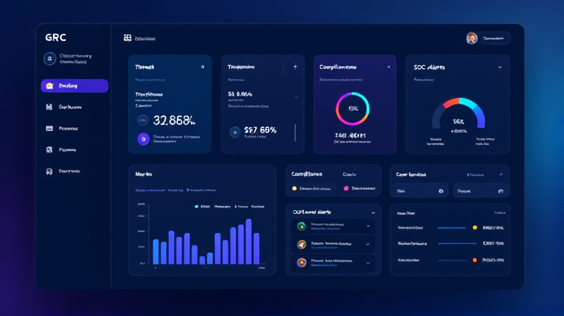
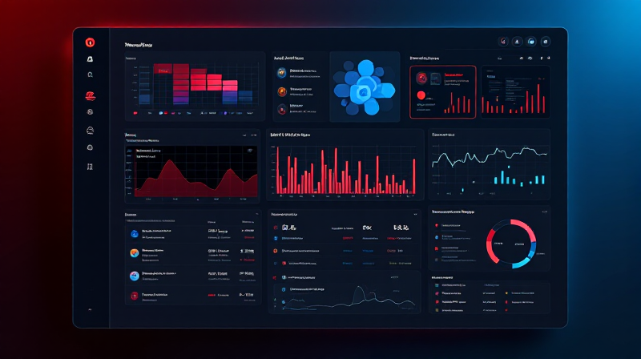
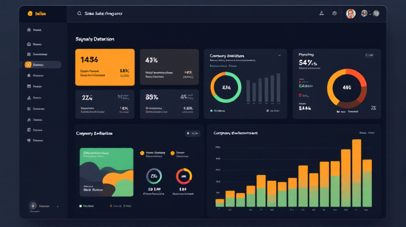
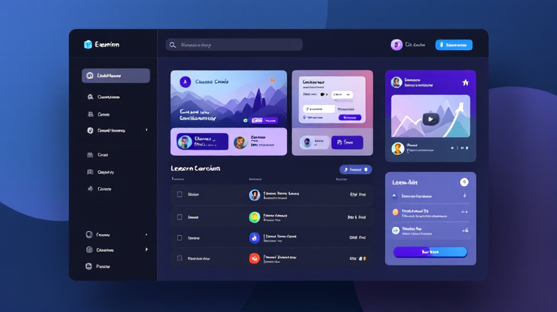

<p align="center">
  <a href="assets/profile-intro.mp4">
    
  </a>
</p>

<picture>
  
</picture>

<p align="center">
  <a href="https://riskitera.com"></a>
  <a href="https://pedri77.github.io"></a>
  <a href="https://linkedin.com/in/david-moya-garcia"></a>
  <a href="mailto:david@riskitera.com"></a>
</p>

<br/>

<picture>
  
</picture>

<br/>


## `> whoami`

Senior **Cybersecurity & AI Platform Engineer** building sovereign, regulation-compliant (ENS Alto, NIS2, DORA, ISO 27001) security platforms with multi-agent AI systems.

Founder of **[Riskitera S.L.U.](https://riskitera.com)**: a B2B GRC/SOC/CTI platform with self-hosted LLM inference, multi-tenant architecture, and zero external data leakage in production.

```
10+ years in cybersecurity & software engineering
Building multi-agent systems with LangGraph + self-hosted LLMs
Focus: data sovereignty, EU compliance, agentic AI for security operations
Currently: scaling Riskitera to regulated enterprises (Spain + LATAM)
```


## `> ls projects/`

<table>
<tr>
<td width="50%" valign="top">

###  [Riskitera](https://riskitera.com)


**B2B GRC/SOC/CTI Platform** with multi-agent AI.

`FastAPI` `Next.js` `Supabase RLS` `LangGraph` `vLLM` `Qdrant`

ENS Alto compliant. Self-hosted LLM inference on Hetzner. 24/7 SOC with 60+ analysts. Multi-tenant with row-level security.

</td>
<td width="50%" valign="top">

###  [MalwareIntel](https://malwareintel.riskitera.com)


**Threat Intelligence Platform** with knowledge graph.

`FastAPI` `Next.js` `Supabase` `STIX 2.1` `MITRE ATT&CK` `Qdrant`

13 public CTI feeds. 109 API endpoints. 63 background workers. Knowledge graph prototype. Dark web intelligence module.

</td>
</tr>
<tr>
<td width="50%" valign="top">

###  [Trigr](https://github.com/pedri77/trigr)


**B2B Sales Signal Radar** powered by 5 AI agents.

`FastAPI` `Next.js` `PostgreSQL RLS` `LangGraph` `Hetzner`

Source crawling, signal detection, context enrichment, scoring, and outreach. From raw data to actionable sales intelligence.

</td>
<td width="50%" valign="top">

###  [st4rtup.com](https://st4rtup.com)


**Academy for Founders**. AI productivity courses.

`Next.js` `FastAPI` `Supabase` `Stripe` `Bunny.net`

Multi-tenant admin. Video streaming via Bunny.net. Stripe payments. First course: "AI Productivity for Founders".

</td>
</tr>
</table>

<details>
<summary><b>More projects</b> (click to expand)</summary>
<br/>

| Project | Status | Description | Stack |
|---------|--------|-------------|-------|
| **[Autonomous Design](https://autonomous-design.pages.dev)** |  | AI-powered web design generator | `Next.js` `CF Pages` `AI` |
| **[Cyber Repo Radar](https://github.com/pedri77/cyber-repo-radar)** |  | Weekly security repo digest for YouTube | `n8n` `Python` `GitHub API` |
| **[Platform Cibersecurity](https://platform-cibersecurity.pages.dev)** |  | Autopiloted technical articles platform | `Next.js` `CF Workers` `MDX` |
| **[Empresa Automatizada](https://github.com/pedri77/TopAutomation)** |  | AI agent suite, 105 tests, 106 endpoints | `FastAPI` `Next.js` `LangGraph` |
| **[Synthcast v3.0](https://github.com/pedri77/synthcast)** |  | AI video production pipeline with lip-sync | `Hedra` `fal.ai` `Remotion` |

</details>


## `> cat tech_stack.yml`

<picture>
  
</picture>

<br/>

<p align="center">
  
</p>


## `> cat architecture.md`

```
                          ┌─────────────────────────┐
                          │    Cloudflare Pages      │
                          │    (Next.js Frontend)    │
                          └────────────┬────────────┘
                                       │
                          ┌────────────▼────────────┐
                          │    FastAPI Gateway       │
                          │    (API + Auth + RLS)    │
                          └────────────┬────────────┘
                                       │
                 ┌─────────────────────┼─────────────────────┐
                 │                     │                     │
     ┌───────────▼──────────┐ ┌───────▼───────┐ ┌──────────▼──────────┐
     │  LangGraph Agents    │ │   Supabase    │ │   Qdrant Vectors    │
     │  (Coordinator +      │ │  PostgreSQL   │ │   (Embeddings +     │
     │   Workers)           │ │  (RLS + RPC)  │ │    RAG)             │
     └───────────┬──────────┘ └───────────────┘ └─────────────────────┘
                 │
     ┌───────────▼──────────┐
     │  vLLM Self-Hosted    │
     │  Hetzner GEX44       │
     │  (Qwen3.5 + Phi-4)   │
     │  ── Data Sovereign ──│
     └──────────────────────┘
```


## `> git log --oneline --stats`

<p align="center">
  <a href="https://github.com/pedri77">
    
  </a>
  <a href="https://github.com/pedri77">
    
  </a>
</p>

<p align="center">
  <a href="https://github.com/pedri77">
    
  </a>
</p>


## `> cat open_source.md`

<table>
<tr>
<td width="33%" align="center">

**[EDR Visual App](https://github.com/pedri77/edr-visual-app)**

EDR/XDR Decision Studio. 26 vendors, Gartner data, CVE tracking.

`JavaScript` `Security`

</td>
<td width="33%" align="center">

**[SASE Visual App](https://github.com/pedri77/sase-visual-app)**

SASE architecture visualization and comparison tool.

`JavaScript` `Networking`

</td>
<td width="33%" align="center">

**[KEV Dashboard](https://github.com/pedri77/kev_dash_project)**

CISA Known Exploited Vulnerabilities dashboard.

`Python` `Streamlit`

</td>
</tr>
<tr>
<td width="33%" align="center">

**[OSM IOC Hub](https://github.com/pedri77/osm-ioc-hub)**

IOC aggregator from OpenSourceMalware feeds.

`Python` `CTI`

</td>
<td width="33%" align="center">

**[Secure Anon](https://github.com/pedri77/Secure_Anon)**

Document anonymization and metadata cleaning.

`Python` `Privacy`

</td>
<td width="33%" align="center">

**[ENS Alto Providers](https://github.com/pedri77/providors_high_ENS)**

Registry of certified ENS Alto cloud providers.

`Jupyter` `Compliance`

</td>
</tr>
</table>


## `> cat expertise.md`

```
 Cybersecurity          Compliance & GRC         Cloud & DevOps
 ─────────────          ────────────────         ──────────────
 SOC Operations         ENS Alto (Spain)         Docker / K8s
 MITRE ATT&CK          NIS2 Directive           Cloudflare
 Threat Intelligence    DORA Regulation          Hetzner Sovereign
 Malware Analysis       ISO 27001                CI/CD Pipelines
 OSINT / Dark Web       EU AI Act                Tailscale Mesh
 Incident Response      RGPD / GDPR              vLLM Deployment
```


<p align="center">
  <a href="https://riskitera.com">
    
  </a>
  &nbsp;&nbsp;
  <a href="https://pedri77.github.io">
    
  </a>
  &nbsp;&nbsp;
  <a href="https://buymeacoffee.com/pedri77">
    
  </a>
</p>

<p align="center">
  
</p>

<p align="center">
  <sub>Building sovereign AI systems for cybersecurity. Based in Madrid, ES.</sub>
  <br/>
  <sub>All production data stays in EU. Zero external API calls with sensitive data.</sub>
</p>

